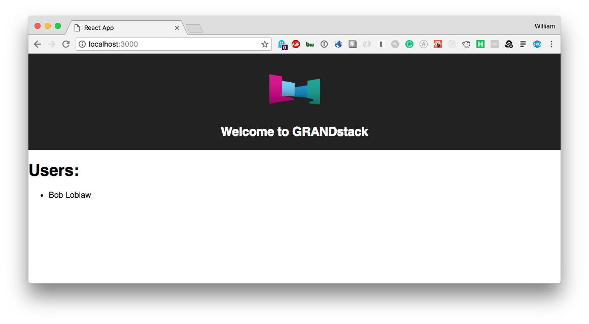

# GRANDstack Starter

This project is a starter for building a [GRANDstack](https://grandstack.io) (GraphQL, React, Apollo, Neo4j Database) application. There are two components to the starter, the UI application (a React app) and the API app (GraphQL server).

## Quickstart

*Install dependencies*

```
(cd ./ui && npm install)
(cd ./api && npm install)
```

*Start API server*
```
cd ./api && npm start
```

This will start the GraphQL API in the foreground, so in another terminal session start the UI development server:

*Start UI server*
```
cd ./ui && npm start
```


*API Env Variables*
NEO4J_URI=bolt://localhost:7687
NEO4J_USER=neo4j
NEO4J_PASSWORD=password
GRAPHQL_URI=http://localhost:4000

*UI Env Variables*
REACT_APP_GRAPHQL_URI=http://localhost:4000

## [`/api`](./api)


## [`/ui`](./ui)

